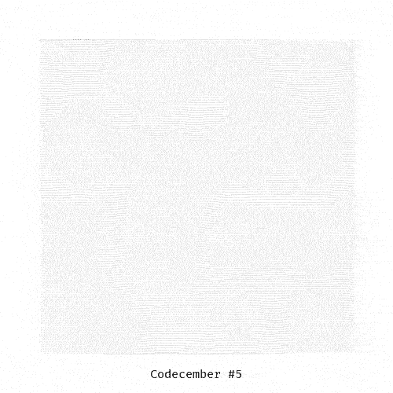
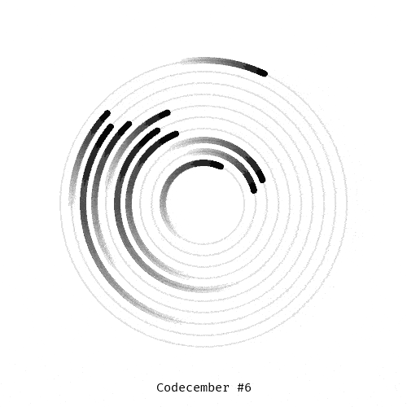
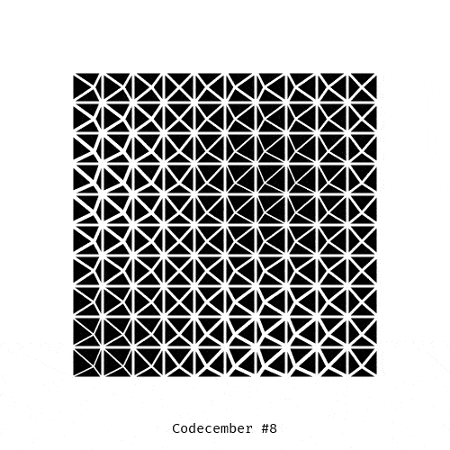

# Codecember

This repository stores the Processing sketches made during the [codecember](https://codecember.ink/) event.

The idea is to produce one sketch a day exploring different concepts and ideas related to creative coding.

## 2020 edition

|  |  |  |
| ---------------------------------- | ---------------------------------- | ---------------------------------- |
|  |  |  |
|  |  |                                    |
|                                    |                                    |                                    |
|                                    |                                    |                                    |
|                                    |                                    |                                    |
|                                    |                                    |                                    |
|                                    |                                    |                                    |
|                                    |                                    |                                    |
|                                    |                                    |                                    |
|                                    |                                    |                                    |

## Links

- [codecember home page](https://codecember.ink/)
- [Processing website](processing.org/)
- [Discourse thread](https://discourse.processing.org/t/an-invitation-to-learn-and-create-computation-form-one-sketch-a-day/25839)